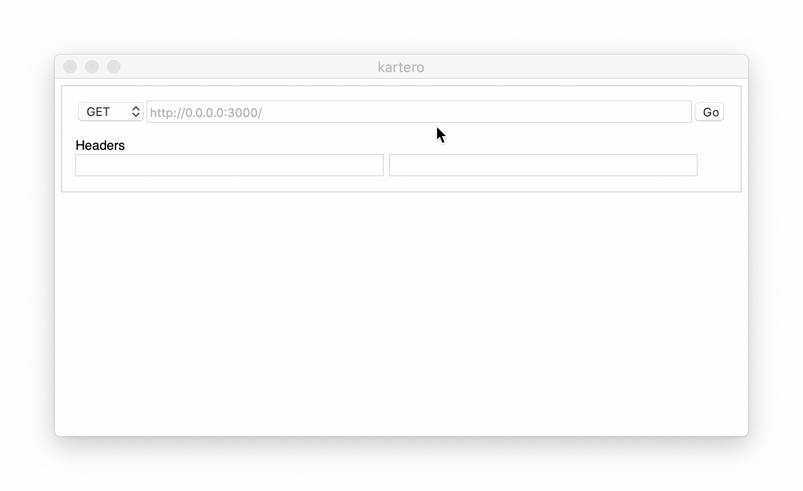

# kartero

A lightweight desktop app for testing REST endpoints

## Installation

Requires npm, gmake, and cargo.

...

## Building

Use `make run` to build and run kartero, or `make build-macos` to build for MacOS. (Other platforms WIP).
